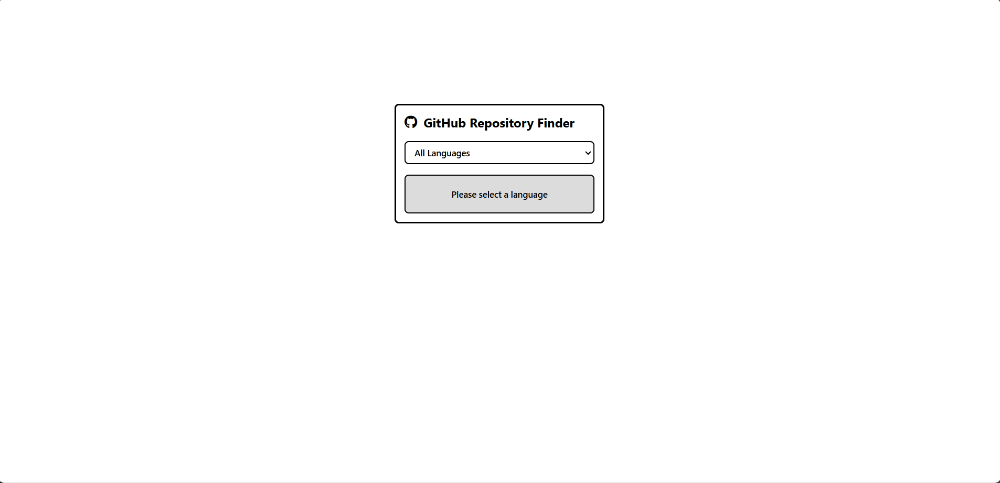

# GitHub Random Repository Finder

A simple web application that discovers random GitHub repositories based on selected programming languages using the GitHub Repository Search API.

## Features

- Select programming languages from dropdown menu
- View repository details (name, description, stars, forks, issues)
- Refresh to find new repositories
- Responsive UI with loading and error states

## Demo



## Technologies

- HTML, CSS, JavaScript
- GitHub Repository Search API
- Fetch API

## Setup

1. Clone the repository
   ```
   git clone https://github.com/abdullayevf/random-github-repository-finder
   ```
2. Insert your GitHub token in the `config.js` file:
   ```javascript
   export const GITHUB_ACCESS_TOKEN = "your_github_access_token";
   ```
3. Open `index.html` in your browser

## Usage

1. Select a programming language
2. View the random repository details
3. Click "Refresh" for another repository

## Project By

G'olib Abdullayev - [github](https://github.com/abdullayevf)

## Inspired By

https://roadmap.sh/projects/github-random-repo
